# 2023 sysY编译器文档
**21373369 熊前锋**
****

## 一、参考编译器介绍

### 1.1 pascals-compiler

`Pascal-S`是`Pascal`语言的真子集，由著名的计算机科学家N.Wirth开发。它保留了`Pascal`语言的大部分功能。样例编译器实现了词法分析、语法分析、表管理、代码生成与解释执行。

#### 词法分析

`Pascal-S`一共定义了51个`symbol`，放在`TYPE symbol`构造类型中。词法分析的功能就是从文本文件中读取字符，识别为51个符号中的一个。

词法分析程序主要有下面几个函数构成，它们的功能分别是：

`nextch`：读取下一个字符

`insymbol`：读取下一个符号

`readscale`：读取浮点型的指数部分

`adjustscale`：调整实数

#### 语法分析

语法分析是`Pascal-S`的重点，也占据了代码的最大篇幅。总体来说，Pascal-S的编译程序采用语法制导的翻译。词法分析，代码生成都是围绕语法分析展开的。语法分析子程序采用了自顶向下的递归子程序法，语法分析同时也根据程序的语意生成相应的代码，并提供了出错处理的机制。

#### 代码生成与解释执行

`Pascal-S`的编译系统并不直接生成机器码，而是生成类似于四元式的中间代码生成的代码被放在`code`数组中，`Pascal-S`共定一个59个四元式指令，编译没有错误后解释执行。

这个过程模拟了一台可以运行中间代码指令的栈式计算机。它拥有一个栈式数据段用于存放运行期数据、拥有一个代码段用于存放中间代码。同时还拥用数据段分配指针、指令指针、指令寄存器、局部段基址指针等寄存器。

### 1.2 pl0-compiler

`PL0`语言是`Pascal`的一个子集，样例编译器同样实现了包括词法分析、语法分析、语义分析以及中间代码生成和解释执行等，能够解释执行输入的`PL/0`源代码。

#### 常量定义部分
定义了一些常量，如保留字个数、标识符表长度、数字的最大位数等。同时定义了一些数据结构，比如`symbol`用于表示符号类型、`objecttyp`表示对象类型、`symset`表示符号集合、`fct`表示操作码等。

#### 全局变量部分
包含了一些全局变量的声明，用于编译器内部使用，如字符读取相关变量、符号表、代码生成器需要的变量等。

#### 子程序部分

`error(n: integer)`：错误处理程序，用于报告编译错误并计数错误个数。
`getsym`：词法分析程序，用于从源代码中获取下一个符号。
`gen(x: fct; y,z: integer)`：代码生成程序，用于生成中间代码。
`block(lev, tx: integer; fsys: symset)`：主要的语法分析程序，负责分析代码块。
其他辅助子程序：如`constdeclaration`、`vardeclaration`、`statement`等，用于处理常量声明、变量声明、语句等部分。

#### 解释器部分

`interpret`是主程序，用于解释执行生成的中间代码。它包含一个简单的虚拟机，利用栈来模拟执行过程。

#### 主程序部分
主程序首先读取源程序文件名，然后对保留字、符号等进行初始化。接着进行词法分析和语法分析，生成中间代码，最后交给解释器执行。

## 二、编译器总体设计

本章从项目文件结构出发，对项目总体结构进行简单的介绍。

### 2.1 项目文件结构

```bash
.                      
│  Compiler.java
│
├─ErrorHandle
│      ErrorHandler.java
│      ErrorType.java
│
├─LexicalAnalyse
│      IOInterface.java
│      LexicalAnalyzer.java
│      LexicalType.java
│      Number.java
│      Word.java
│
├─LlvmGenerate
│  │  BasicBlock.java
│  │  LlvmGenerator.java
│  │  LlvmTree.java
│  │  MiddleVal.java
│  │  RegisterPool.java
│  │
│  ├─Definitions
│  │      Function.java
│  │      GlobalDecl.java
│  │      Parameter.java
│  │
│  └─Instructions
│      │  InsFactory.java
│      │  Instruction.java
│      │
│      ├─Calculations
│      │      AddIns.java
│      │      AndIns.java
│      │      IcmpIns.java
│      │      MulIns.java
│      │      OrIns.java
│      │      SdivIns.java
│      │      SremIns.java
│      │      SubIns.java
│      │
│      ├─Jump
│      │      BrIns.java
│      │      CallIns.java
│      │      RetIns.java
│      │
│      └─Memories
│              AllocaIns.java
│              GetelementptrIns.java
│              LoadIns.java
│              StoreIns.java
│              ZextToIns.java
│
├─SymbolTable
│      FuncSymbol.java
│      Symbol.java
│      SymbolTable.java
│      VarSymbol.java
│
└─SyntaxAnalyse
    │  SyntaxAnalyzer.java
    │
    └─SyntaxTreeNodes
            AddExp.java
            Block.java
            BlockItem.java
            BType.java
            CompUnit.java
            Cond.java
            ConstDecl.java
            ConstDef.java
            ConstExp.java
            ConstInitVal.java
            Decl.java
            EqExp.java
            Exp.java
            ForStmt.java
            FuncDef.java
            FuncFParam.java
            FuncFParams.java
            FuncRParams.java
            FuncType.java
            InitVal.java
            LAndExp.java
            LOrExp.java
            LVal.java
            MainFuncDef.java
            MulExp.java
            PrimaryExp.java
            RelExp.java
            Stmt.java
            UnaryExp.java
            UnaryOp.java
            VarDecl.java
            VarDef.java
```

项目总体由一个主程序`Compiler.java`和五个包组成。`Compiler`类是整个项目的入口，它接收源文件的输入，并调用各个部分的接口来完成相应的功能，输出至指定文件。五个包则分担了不同的工作：

`LexicalAnalyse`：承担词法分析部分的工作。
`SyntaxAnalyse`：承担语法分析部分的工作。
`SymbolTable`：承担符号表部分的工作。
`ErrorHandle`：承担错误处理部分的工作。
`LlvmGenerate`：承担`llvm`中间代码生成的工作。


### 2.2 接口设计

#### 文件操作接口

实验要求涉及到多个文件的读写，不同阶段输出的文件也不同，因此编写了一个`IOInterface.java`文件，编写了一系列静态的方法供其他类中调用。

#### 词法分析、语法分析接口

词法分析的主类在`LexicalAnalyzer.java`文件中编写，语法分析的主类则在`SyntaxAnalyzer.java`文件中编写。`LexicalAnalyzer`向外提供的接口是`completeAnalyse()`方法，它将在`SyntaxAnalyzer`中被调用，`SyntaxAnalyzer`接收一个源字符串，对它采用递归下降法进行语法分析，并将结果输出至`out.txt`文件中。

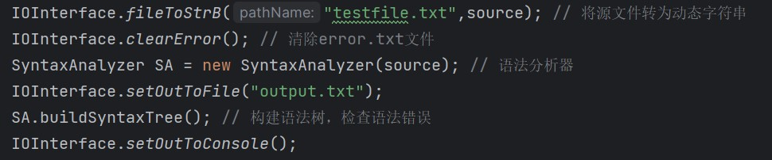

#### 错误处理接口

错误处理的逻辑代码主要在语法分析的主程序中实现，`ErrorHandler.java`文件中实现的`ErrorHandler`类主要提供了一个`handleError(ErrorType errorType,int line)`方法直接在错误处理逻辑处调用，用以指定格式打印错误。

#### 代码生成接口

`LlvmGenerator`的构造方法需要传入此前语法分析的`SyntaxAnalyzer`实例`SA`，以获取建立的语法树，并根据语法树进行语法制导翻译，生成相应的`llvm IR`代码，输出至`llvm.txt`文件中。

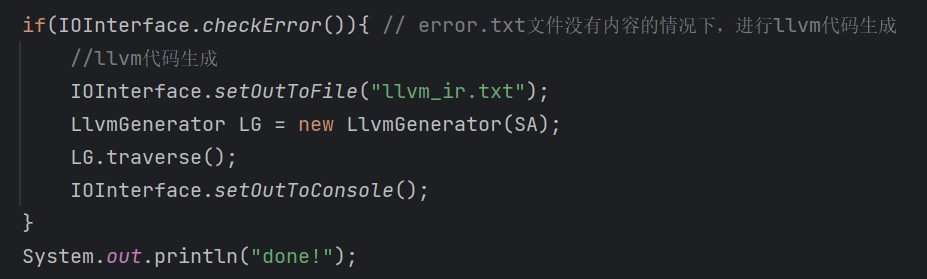


## 三、词法分析设计

### 3.1 理论分析

#### 3.1.1 理论基础

词法分析的理论基础是有穷自动机`DFA`（或有限状态自动机`FSA`）。`DFA`包含**状态集**和不同状态之间的**转移函数**，通过当前状态（现态）和输入来判断下一状态（次态），即:$$p' = δ(p,a)$$用以接收一个输入串，来判断这个输入串是否是属于某一种语言的句子。通常来讲，`DFA`可以由正则文法构造，在词法分析部分，我们需要用到它来为我们解析源程序，将源程序由一个纯字符串识别为各种类型（因此就是要构造识别各种类型单词的DFA）的单词，为后续的语法分析做好铺垫，提供调用的接口。

### 3.2 编码设计

#### 3.2.1 词法分析总体设计

为了实现词法分析器，先确定了本部分需要完成的具体任务：

* 接收的输入：源文件`testfile.txt`的文本内容；

* 需要的输出：源文件的词法分析结果，包括给定的`单词类型`和`单词值`。

根据需求，总体设计如下：
1. 为了接收文本文件的内容和输出至指定文件，需要一定的IO接口，实现从文件→字符串→文件。
2. 根据每种单词类别（见下表），设计识别该类别单词的`DFA`。
    <table>
    <thead>
    <tr>
    <th>单词名称</th>
    <th>类别码</th>
    <th>单词名称</th>
    <th>类别码</th>
    <th>单词名称</th>
    <th>类别码</th>
    <th>单词名称</th>
    <th>类别码</th>
    </tr>
    </thead>
    <tbody>
    <tr>
    <td>Ident</td>
    <td>IDENFR</td>
    <td>!</td>
    <td>NOT</td>
    <td>*</td>
    <td>MULT</td>
    <td>=</td>
    <td>ASSIGN</td>
    </tr>
    <tr>
    <td>IntConst</td>
    <td>INTCON</td>
    <td>&amp;&amp;</td>
    <td>AND</td>
    <td>/</td>
    <td>DIV</td>
    <td>;</td>
    <td>SEMICN</td>
    </tr>
    <tr>
    <td>FormatString</td>
    <td>STRCON</td>
    <td>||</td>
    <td>OR</td>
    <td>%</td>
    <td>MOD</td>
    <td>,</td>
    <td>COMMA</td>
    </tr>
    <tr>
    <td>main</td>
    <td>MAINTK</td>
    <td>for</td>
    <td>FORTK</td>
    <td>&lt;</td>
    <td>LSS</td>
    <td>(</td>
    <td>LPARENT</td>
    </tr>
    <tr>
    <td>const</td>
    <td>CONSTTK</td>
    <td>getint</td>
    <td>GETINTTK</td>
    <td>&lt;=</td>
    <td>LEQ</td>
    <td>)</td>
    <td>RPARENT</td>
    </tr>
    <tr>
    <td>int</td>
    <td>INTTK</td>
    <td>printf</td>
    <td>PRINTFTK</td>
    <td>&gt;</td>
    <td>GRE</td>
    <td>[</td>
    <td>LBRACK</td>
    </tr>
    <tr>
    <td>break</td>
    <td>BREAKTK</td>
    <td>return</td>
    <td>RETURNTK</td>
    <td>&gt;=</td>
    <td>GEQ</td>
    <td>]</td>
    <td>RBRACK</td>
    </tr>
    <tr>
    <td>continue</td>
    <td>CONTINUETK</td>
    <td>+</td>
    <td>PLUS</td>
    <td>==</td>
    <td>EQL</td>
    <td>{</td>
    <td>LBRACE</td>
    </tr>
    <tr>
    <td>if</td>
    <td>IFTK</td>
    <td>-</td>
    <td>MINU</td>
    <td>!=</td>
    <td>NEQ</td>
    <td>}</td>
    <td>RBRACE</td>
    </tr>
    <tr>
    <td>else</td>
    <td>ELSETK</td>
    <td>void</td>
    <td>VOIDTK</td>
    <td></td>
    <td></td>
    <td></td>
    <td></td>
    </tr>
    </tbody>
    </table>
3. 将DFA编写为相应的代码，设计好相应的方法接口。
4. 在主函数中调用并输出相应要求的内容至指定文件。

#### 3.2.2 类设计
##### IOInterface

相当于一个有关编译器的所有`I/O`相关方法库。后续所有和`I/O`相关的方法在此编写，统一设计为`public static`方法，供其他类中直接通过类调用。

##### LexicalAnalyzer

词法分析的核心部分。用来实现DFA的处理逻辑，词法分析阶段在主类`Compiler`中实例化，考虑其特性可以设计为单例模式。

##### LexicalType

`enum`枚举类，用来表示上表中所有的单词类型。

##### Word

即文法分析单词的对应数据结构。每个DFA中分析完成后，就实例化一个`Word`，并根据需求保存或输出。由上述需求，`Word`类至少需要包含两个属性：`type`和`token`（输出需要）。

#### 3.2.3 逻辑代码与方法接口

`LexicalAnalyzer`对象接收源程序字符串，通过调用`next()`方法来解析出一个单词。

##### `next()`方法

**词法分析核心方法**，读入字符并判断是哪一类单词的首字符，进而进入相应的DFA中，最后返回一个单词。

例如，识别标识符（ident）和保留字的代码片段：

```java
if(charIsIdent(readChar)){ // 标识符和保留字
            token += readChar;
            while(position < sourceLen && (charIsIdent(source.charAt(position)) ||
                    charIsDigit(source.charAt(position)))){
                readChar = source.charAt(position++);
                token += readChar;
            }
            if(isReserve(token)){
                return new Word(reservedWords.get(token),token,line);
            }else{
                return new Word(LexicalType.IDENFR,token,line);
            }
        }
```

##### `printToFile()`方法

暂为词法分析输出结果设计的方法，将`next()`方法返回的单词按指定的格式输出至`output.txt`文件中。

### 3.3 修改完善

针对词法分析器主要进行了一个方向的修改考虑：

**“词法分析对源代码进行完整的一遍分析，还是仅为语法分析提供一次解析一个单词的接口？”**

#### 初步设计
根据编码前的分析，只提供了一个`next()`接口为语法分析所调用，仅在词法分析部分，也通过循环调用此方法来进行输出。

#### 问题分析
在`LexicalAnalyzer`中需要有属性变量`postion`来记录目前输出字符的位置。如果只考虑词法分析，上述问题无伤大雅，不对结果和编码难度产生任何影响。但考虑到语法分析阶段会在递归子程序中用到获取单词的方法，为了判断语法成分，可能不止会线性地不断读取下一个单词，例如会**往前回溯一个或者往后多读一个**等情况，只提供`next()`方法在这种情况下会带来很大的不便。

#### 确定更改
对源代码在词法分析阶段进行完整的一遍分析，并将结果保存在一个`ArrayList`中，作为词法分析阶段的结果，留给语法分析进行处理，这样保证了到后续语法分析阶段能有足够的灵活性。

##### `completeAnalyse()`方法

调用`next()`方法对整个字符串进行词法分析，并将所有的单词存入`ArrayList<Word> wordList`中,方便输出和后续语法分析的调用。

```java
public void completeAnalyse(){
        //完成对源程序的完全词法解析，并将全部单词放入单词表
        int scanP = position; // 记录position
        position = 0; // 位置指针移到source开头
        while(position < sourceLen){
            wordList.add(next());
        }
        position = scanP; // 位置指针回归原位
    }
```

## 四、语法分析设计

### 4.1 理论分析

语法分析过程实际上就是搭建语法树的过程。此过程采用了**自顶向下**的分析方法——**递归下降法**，对于每一种语法成分（文法中的非终结符），都为其编写一个分析函数（递归子程序），并从开始符号的分析函数中进入，开始**递归地**去调用这些分析函数，最终完成对语法的分析。
在分析函数中，分析的单位为单词，即前面的词法分析工作所完成的部分。

### 4.2 编码设计

#### 4.2.1 语法分析总设计

为了实现语法分析器，先确定了本部分需要完成的具体任务：

* 接收的输入：词法分析完成的结果`worldList`。

* 必要工作：建立语法树。

* 需要的输出：词法分析基础上，在特定语法成分结束处打印该语法成分的名字（即非终结符）。

根据需求，总体设计如下：

1. 将语法树节点，即每一种语法成分编写成类，用其属性变量来表示子节点，用以构建语法树。
2. 定义好递归程序需要用到的接口，如`getsym()`等，避免过多直接操纵`wordList`。
3. 完成递归子程序编写，并定义好相关的调用接口。
4. 考虑输出逻辑，完成语法分析的调用。

#### 4.2.2 类设计

##### SyntaxAnalyzer

语法分析的核心部分。用来实现递归下降分析程序，语法分析阶段在主类Compiler中实例化，考虑其特性可以设计为单例模式。

##### SyntaxTreeNodes包

每个语法成分（非终结符）都单独设计成一个类。在递归分析时方便建立语法树。

例如语法树的根节点：

```java
public class CompUnit{ // 语法树根节点：编译单元
    private ArrayList<Decl> declList; // {Decl}子节点
    private ArrayList<FuncDef> funcDefList; // {FuncDef}子节点
    private MainFuncDef mainFuncDef; // MainFuncDef子节点
    public CompUnit(ArrayList<Decl> declList, ArrayList<FuncDef> funcDefList, MainFuncDef mainFuncDef){
        this.declList = declList;
        this.funcDefList = funcDefList;
        this.mainFuncDef = mainFuncDef;
    }
    public void printSyntax(){
        System.out.println("<CompUnit>");
    }
}
```

*在语法分析阶段，仅完成题目的需求似乎是不需要用到语法树的，因为想要在源代码每个语法成分结尾时打印其名字，只需要在对应语法成分的递归子程序返回前打印即可，这取决于递归程序的特性，而语法树的用途在后面才会显现出来。

#### 4.2.3 逻辑代码与方法接口

递归下降法本身是一件简单的事情。因为递归性质都交给了我们编写编译器的高级语言，我们作为设计者只需要去考虑每一个语法成分的分析程序该怎么进行即可。具体而言，对于一条文法规则，其左部为非终结符，右部则是要分析的成分，我们规定，所有递归子程序在调用下一个程序前都要帮它**预读**一个单词，有此规定后，所有子程序开始并不需要先读一个单词，直接从一个保存当前单词（也就是调用它的程序为它预读的单词）的变量中取值即可。

##### `getsym()`方法

词法分析中提到，我们将词法分析结果存在了`worldList`中。这样，就可以针对`wordList`做语法。词法分析还提到，语法分析的基本单位是单词，此方法则相当于获取单词的接口。

``` java
private ArrayList<Word> wordList; // 词法分析器的结果集：单词表
private Word sym; // 当前sym
private int symPosition; // 单词表当前下标
public void getSym(){
        // 参考递归下降法的getSym方法，读取一个sym，并将其值保存在sym中
        // 注意，在本类中此方法外的任意程序片段，访问sym与访问wordList.get(symPosition)等效
        System.out.print(sym);
        sym = wordList.get(++symPosition);
    }
```

不排除在[词法分析改进阶段](#33-修改完善)我们留下的问题，除了直接访问`sym`，也提供了`symPosition`来支持对`wordList`的访问，以便灵活实现分析程序。

##### 递归子程序

以`CompUnit`为例，具体看一个递归子程序的设计思想：

> `CompUnit → {Decl} {FuncDef} MainFuncDef`

（命名思路：成分+Rec（recursion））
```java
private CompUnit compUnitRec(){ // compUnit递归子程序
        // Decl 和 FuncDef 都是可选任意次，用List记录
        ArrayList<Decl> declList = new ArrayList<>();
        ArrayList<FuncDef> funcDefList = new ArrayList<>();
        while(symIsDecl()){
            Decl decl = declRec(); // 调用decl递归子程序
            declList.add(decl);
        }
        while(symIsFuncDef()){
            FuncDef funcDef = funcDefRec(); // 调用funcDef递归子程序
            funcDefList.add(funcDef);
        }
        MainFuncDef mainFuncDef = mainFuncDefRec(); // 调用mainFuncDef递归子程序

        CompUnit compUnit = new CompUnit(declList, funcDefList, mainFuncDef);
        compUnit.printSyntax(); // 打印语法成分
        return compUnit;
    }
```

这是典型的递归下降法的分析程序。

### 4.3 修改完善

语法分析的修改完善源自初次编写完代码后提交发生的一个错误。通过测试样例的比对，发现了问题所在，它牵扯到了语法树的严谨性。

举个例子来说明。对于下面这个表达式：

> `b + c`

按照题目给出的文法规则：

>   Exp → AddExp;
    AddExp → MulExp | AddExp ('+' | '−') MulExp
    ...(只推到MulExp)

按照原始文法，正确的语法树应该如下图所示(只考虑到MulExp成分这里)：

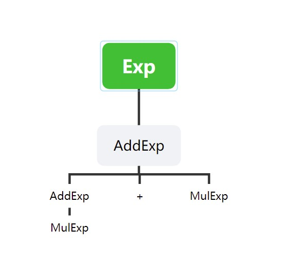

然而，原始文法是左递归文法，不能直接用于递归子程序，否则会造成死循环。使用扩充的BNF表示法改写文法后得到了这样的文法表示：

> AddExp → MulExp { ('+' | '−') MulExp }

它与原文法是等价的。

但是似乎出现了一点问题...真的是“完全等价”的吗？我们用这个改写的文法来尝试构建语法树，出现了问题：

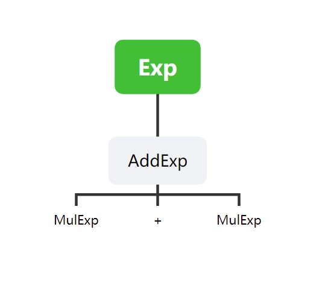

没错，居然比原来的语法树少了一层。少了从`AddExp`到`MulExp`的一层。这也很好解释，因为改写的时候，我们将第一步左递归的那一侧进行了一次到其`FOLLOW`集的推导。这导致了一个结果：输出语法成分时，少了一个`AddExp`。

想要满足语法分析阶段的输出结果也很简单，在这个递归程序的适当位置补上`AddExp`的输出语句即可，遗憾是无法构建像改写文法之前那样的语法树，这个会不会有影响，目前还不得而知。

```java
//AddExp的递归子程序
private AddExp addExpRec(){ // addExp子程序
        // AddExp → MulExp { ('+' | '−') MulExp }
        ArrayList<MulExp> mulExpList = new ArrayList<>();
        MulExp mulExp = mulExpRec();
        mulExpList.add(mulExp);
        while(sym.getType() == LexicalType.PLUS || sym.getType() == LexicalType.MINU){
            System.out.println("<AddExp>"); // 由于消除左递归导致的语法树缺失一层问题
            getSym();
            MulExp mulExp1 = mulExpRec();
            mulExpList.add(mulExp1);
        }
        AddExp ae = new AddExp(mulExpList);
        ae.printSyntax();
        return ae;
    }
```

## 五、错误处理

### 5.1 编码设计

#### 5.1.1 错误处理总设计

为了实现部分语法错误检测，先确定本部分需要完成的具体任务：

* 接收的输入：词法分析完成的结果`worldList`。

* 在前面的语法分析部分，实现了对源程序语法成分的分析，并构建了语法树，但是建立在源程序符合文法、没有语法错误的基础上的。在语法分析部分，`SyntaxAnalyzer`类的编写中，留下了很多空代码块的`if-else`语句，这些是为错误处理留下的接口。当然，这些接口一定是不完善的。

* 需要的输出：检测出要求的所有错误后，输出错误的类型和其所在的行号至`error.txt`文件中。

根据需求，总体步骤如下：

1. 设计进行错误处理的类，编写处理逻辑。
2. 封装所设计的类方法等，在`SyntaxAnalyzer`类中不要写过多的错误处理细节如输出等等，尽量保证模块化。
3. 考虑题目要求的错误类型，分析语法结构，找出所有可能出现错误的可能性。
5. 设计符号表，为定义冲突等错误做准备。
4. 对可能的语法错误进行逐一地编码处理、排查，输出结果至指定文件。

#### 5.1.2 类设计

##### ErrorHandler

错误处理类，它封装了错误类型的输出，通过调用其中的`handleError(errorType, line)`来对错误进行指定格式的输出。

它被封装为一个静态的单例模式，静态实例化一次后，在语法分析器类`SyntaxAnalyzer`中被以单例模式调用，在需要输出错误的程序片段调用。

```java
public class ErrorHandler {
    private ErrorHandler(){}
    private static final ErrorHandler Single = new ErrorHandler();
    public static ErrorHandler getInstance(){
        return Single;
    }
    public void handleError(ErrorType errorType,int line) {
        try {
            IOInterface.setOutToError(); // 打印错误准备
            System.out.println(line+" "+errorType.toString());
            IOInterface.setOutBack(); // 关闭错误打印
        } catch (FileNotFoundException e) {
            throw new RuntimeException(e);
        }
    }
}
```

##### ErrorType 枚举类

题目中错误类型由字母表顺序标识：a,b,c,d,...

为了错误类型更直观地展示，方便编码，并提高代码的可读性和结构化，并便于后续再添加错误类型等，设计枚举类标识错误类型，并实现相应的`toString`方法仍按原要求输出。源代码较长，以其中三个错误为例：

```java
public enum ErrorType {
    IllegalSymError, // 非法符号 a
    RedefineError, // 名字重定义 b
    UndefineError, // 名字未定义 c
    public String toString(){
        switch (this){
            case IllegalSymError -> {
                return "a";
            }
            case RedefineError -> {
                return "b";
            }
            case UndefineError -> {
                return "c";
            }
            default -> {
                return null;
            }
        }
    }
}

```

##### SymbolTable包

这是符号表的部分。为了检测出名字未定义、名字重定义等**上下文有关**的语法错误，必须借助符号表或类似结构来实现（比如全局变量等，本质上和符号表一样，都是起到了记录上下文有关信息，以便在上下文无关文法中实现上下文有关的语义，后续代码生成也会用到）

这部分主要设计了四个类：`SymbolTable`符号表类、`Symbol`符号类、`VarSymbol`变量符号类、`FuncSymbol`函数符号类，其中`VarSymbol`命名虽为变量符号，常量也作为“变量符号”归入此类。`VarSymbol`和`FuncSymbol`继承`Symbol`类，这个继承关系是顺其自然的。

#### 5.1.3 逻辑代码与方法接口

##### 符号表设计

1. 表结构设计

从符号表类`SymbolTable`的属性出发：

``` java
private int layer; // 层级
private HashMap<String,Symbol> table; // 符号表
private SymbolTable parent; // 父节点 最外层为null
```

其中真正用来存储符号的字段是`table`，用`HashMap`类实现了一个存放符号类型的符号表，键和值分别为符号的`token`和符号对象。

`layer`来表示当前符号表的层次，例如刚进入`CompUnit`的分析程序时`layer`为0，每次进入一个`Block`就生成一张新的符号表作为“当前符号表”，层次在上层基础上加一，退出就减一，并提供相应的退出符号表的方法，如下。

```java
// in SyntaxAnalyzer.java:
private void createSymTab(){ // 创建符号表
    symTab = new SymbolTable(symTab);
}
private void exitSymTab(){ // 回到上一层
    symTab = symTab.getParent();
}
// in SymbolTable.java:
public SymbolTable(SymbolTable parent){
    this.layer = parent.getLayer() + 1;
    this.table = new HashMap<>();
    this.parent = parent;
}
```
其中，`SymTab`为声明在语法分析器中的字段属性，作为“当前符号表”来使用。

作为在对象关系上“属于”某层符号表的符号，`Symbol`类中也有一个`layer`字段，表示其所处层级。

这样一来，就在语法树生成的过程中（或者说源程序“运行”的过程中）生成了一张动态的**栈式符号表**。

2. 符号表提供的操作

在符号表的动态生长过程中，可以在声明变量或者定义函数时查表和填表。通过**定义前检查符号是否已经在符号表中**和**使用前符号表是否在符号表中已定义**两个符号表的逻辑操作，可以找出与名字定义有关的语法错误。

```java
// 检查符号在当前层是否已经声明:
private boolean symHadDeclared(String token){ // 符号已声明，在当前层次的符号表中已存在token相同的符号
    for (String key:symTab.getTable().keySet()){ // 遍历符号表
        if(symTab.getTable().get(key).getToken().equals(token)){
            return true;
        }
    }
    return false;
}

// 声明变量型符号
public boolean declareVar(String token, int dimension, ArrayList<Integer> length, boolean isConst){ // 声明符号：填表
    if(symHadDeclared(token)){
        return false;
    }
    VarSymbol vs = new VarSymbol(token, symTab.getLayer(), dimension, length, isConst);
    symTab.getTable().put(token,vs);
    return true;
}
```

函数符号的声明与变量符号类似，仅以此为例。另外还提供了可以在本层以及上层搜寻符号的方法（例如在`layer = 3`的层调用，可以在0、1、2、3层中查找），以解决错误处理“未定义”的问题，并在代码生成中访问变量或调用函数时起作用。

##### 错误处理逻辑

错误处理在语法分析中进行。`ErrorHandler`类只负责使用指定方法将传入的错误类型和行号输出至指定文件中，而何时输出错误，输出哪种错误，需要在语法分析的程序中给出，并在指定位置插入输出错误的代码。

以一个c类错误为例：

`lVal`语法成分可能产生未定义错误，分析至标识符`ident`时，搜索符号表检查标识符是否已经声明过，若在符号表中查找结果为空（`searchSymbol(ident.getToken()) == null`），则需要输出错误类型中定义的`UndefineError`，即c类错误。

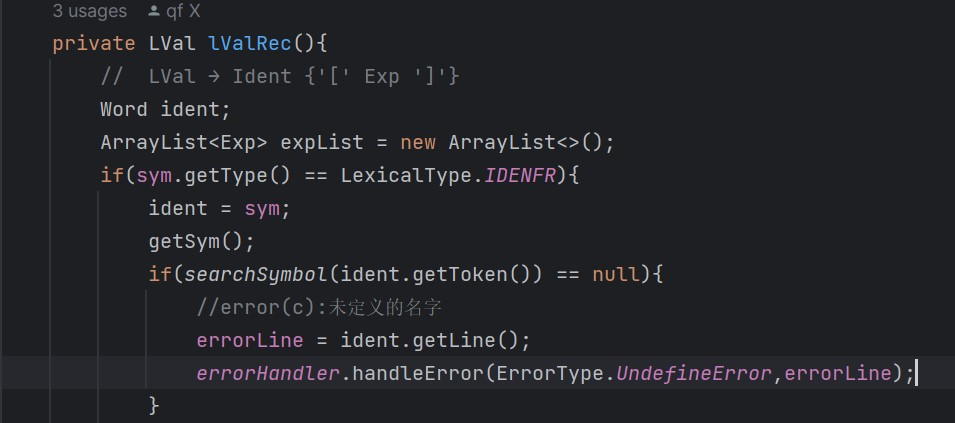

### 5.2 修改完善

上述设计是代码的最终版本。在设计初期，笔者探索过不同的设计进行错误处理，主要思路有两种。

#### 初步设计

##### 语法分析-错误处理一遍进行

在前面的语法分析过程中，为某些类型的语法错误留下了接口，可以较方便地在相应可能产生语法错误的地方进行错误类型的判断和输出。

但是，只有少部分错误是可以方便地这样处理的。处理其他错误时，一定会让原本已经足够复杂的语法分析程序进一步变得更臃肿，最严重的情况是产生不可预知的bug，影响到对正确源程序的语法分析。这种情况的可能性不小，因为毕竟在原来的语法分析程序内植入了大量新的代码。

##### 语法分析、错误处理两遍进行

参考之前词法分析、语法分析两遍进行的思路，错误处理和语法分析也可以两遍进行。具体来讲，保留原来的语法分析程序，它只用于处理语法正确的源程序，按照递归子程序的结构再编写一个递归的错误处理程序，专门编写错误处理的所有接口，一旦接收的源程序是错误的，就进入错误处理程序处理。

这样做的考虑是，保留处理正确源程序的语法分析程序，防止错误处理的代码与语法分析耦合过深，而导致语法分析程序错误。

#### 问题分析

两种方法各有优劣，因此笔者主要考虑实现的难度。

一遍进行很简单，且只有一个问题：容易影响到语法分析程序。

两遍进行则面对较多的问题。首先需要重写一遍语法成分的递归程序，这一工作量已经足够大，而功能不同导致无法有效复用语法分析的递归程序，对词法分析的结果进行两次递归遍历分析必然导致大量的重复代码，这种程度的代码重复远比在语法分析程序中加入错误处理带来的臃肿要严重得多。其次，舍弃语法分析程序也意味着语法分析程序中留下的错误处理接口都没有被利用到，语法分析程序被视为只用处理完全正确源程序的一遍逻辑，**前面的很多工作都成无效工作了**。

#### 最终设计

最终选择一遍方式，直接在语法分析程序中进行错误处理。针对这种方法可能产生的问题，必须在编写错误处理时**格外小心**。

```java
public class SyntaxAnalyzer {
    private int errorLine; // 错误处理的行号
    private static final ErrorHandler errorHandler = ErrorHandler.getInstance(); // 错误处理单例
    ...
    ...
    ...
}
```

## 六、代码生成

### 6.1 编码设计

#### 6.1.1 代码生成总分析

笔者选择的是`llvm`中间代码生成，为了实现生成`llvm`代码，先确定本部分需要完成的具体任务：

* 接收的输入：语法分析构建的语法树`SA.root`。

* 根据语法分析构建的语法树，遍历语法树，进行语法制导的翻译。

* 需要的输出：将翻译后的`llvm`代码输出至`llvm.txt`文件中。

根据需求，总体步骤如下：

1. 熟悉`llvm`的语法特性，掌握其中要用到的指令。
2. 根据语法制导翻译的逻辑，划分功能模块，设计类。
3. 为设计的类实现具体的方法，并实现主程序`LlvmGenerator`代码生成的逻辑。
4. 封装、完善，确保正确输出至指定文件。

#### 6.1.2 类设计

代码生成部分的文件结构较前面稍复杂，这里选取几个重要的类进行介绍，可以结合[总体设计部分的文件树](#21-项目文件结构)一起阅读。

##### LlvmTree类

从源文件来看，文件的语法结构可以分为三个部分：全局变量声明、函数声明和主函数。

> `CompUnit → {Decl} {FuncDef} MainFuncDef`

其中，主函数和函数在结构上没有什么区别，因此可以分为两个部分：全局声明和函数。因此，对于翻译得到的`llvm IR`文件，它可以看作由一系列全局声明 + 一系列函数体组成。

`LlvmTree`就是这样一个类，它用于记录翻译过程中产生的`llvm IR`文件的各个成分，使用重写的`toString()`方法输出至`llvm.txt`即可得到最终输出。

```java
public class LlvmTree {
    // llvm_ir文件就是全局变量声明和函数体的集合
    private ArrayList<GlobalDecl> globalDeclList;
    private ArrayList<Function> functionList;
    public LlvmTree(){
        this.functionList = new ArrayList<>();
        this.globalDeclList = new ArrayList<>();
    }
    public void addFunction(Function function){
        this.functionList.add(function);
    }
    public void addGlobalDecl(GlobalDecl globalDecl){
        this.globalDeclList.add(globalDecl);
    }

    @Override
    public String toString() {
        StringBuilder str = new StringBuilder();
        str.append("declare i32 @getint()\n").append("declare void @putint(i32)\n").append("declare void @putch(i32)\n").append("declare void @putstr(i8*)\n");
        for (GlobalDecl globalDecl : globalDeclList) {
            str.append(globalDecl.toString());
            str.append("\n");
        }
        str.append("\n");
        for (Function function : functionList) {
            str.append(function.toString());
            str.append("\n");
        }
        return str.toString();
    }
}
```
可以看到，`LlvmTree`类向外主要提供了两个方法：

`addFunction(Function function)`和`addGlobalDecl(GlobalDecl globalDecl)`，顾名思义，当完成一条函数或者全局声明的翻译后，就将这个结构加入`LlvmTree`中，统一向下调用`toString()`方法来输出`llvmIR`代码。

##### BasicBlock类

为了实现分支语句和循环语句等含有跳转命令的语句，必须引入基本块。上面的`LlvmTree`中，一个`Function`由若干基本块组成，而每个基本块由若干条连续执行的`llvm IR`指令组成。具体来说，它包含一个标签和一个指令列表：

```java
public class BasicBlock {
    private String label;
    private ArrayList<Instruction> instructionList;
    ...
    ...
}
```

##### MiddleValue类

自认为这是代码生成中设计最精妙、功能覆盖面最广的一个类。

在做各种运算时非常重要的一个类。命名为`MiddleValue`，因为它在各种运算中起到记录当前阶段计算所得值的作用。代码生成程序（`LlvmGenerator`，将在后面介绍）中实例化了一个做全局变量使用的`MiddleValue`类的对象，参与各种运算。

例如对于下面这个最简单的源程序：

```c
int main(){
    return 1 + 1;
}
```

它生成的`llvm IR`文件是这样的：

```llvm
define i32 @main(){
	%r0 = add i32 1, 1
	ret i32 %r0
}
```

这里涉及到的文法规则是，`Stmt -> return Exp`，递归计算表达式`Exp`的值时，会依次进入`AddExp`、`MulExp`、`UnaryExp`等语法成分的递归子程序中。

加法表达式子程序中，通过递归加号左边的乘法表达式，最终可以算出值为常数1，此时就用全局变量`MiddleValue middleValue`记录下这个值，递归栈退回到加法表达式子程序后，取全局变量值就是这个“1”的值，同理再递归右边的乘法表达式，最后将两值根据需求直接相加或生成`add`命令即可。

加法表达式子程序的结尾，会相应改变此时`middleValue`的值，作为执行加法的“中间值”继续传给外层。例如在上面的源代码中，加法表达式子程序生成了`add`命令，因此将`middleValue`记为表示其结果的寄存器类型，赋值为寄存器名"%r0"，这样在递归程序栈退到`Exp`表达式子程序时可以取到其值为寄存器类型的"%r0"，再生成`ret`命令。

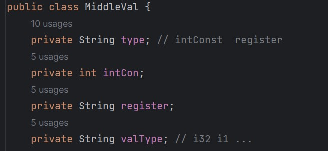

上图是`MiddleValue`类的属性，`type`字段表示实例的类型，例如，`intConst`表示常数，此时`register`字段无效，其常数值存在`intCon`字段中；如果类型为`register`，则表示中间运算的结果存在了一个寄存器中，此时`intCon`字段无效，寄存器名存在`register`字段中。上面简单源程序的举例实则将两种情况都覆盖到了。

实际上，除了上面举的例子，在待翻译源程序的绝大部分地方、凡是涉及到了“值”的程序片段，都需要借助`MiddleValue`类来处理。

##### RegisterPool类

一个不起眼的小类，实际上其功能甚微，仅维护一个自增的整数，提供一个对外的方法，用于在每次需要生成含有寄存器的指令时返回一个寄存器名。本项目的局部寄存器命名规则是："%ri"，其中`i`为一个从0开始自增的整数。

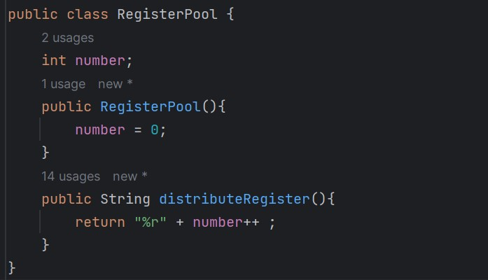

##### Definitions包

包含三个类：`Function`、`GlobalDecl`、`Parameter`

这三个类都是`llvm IR`语法成分（或者说都是`llvmTree`的一部分），也就是说都可以通过重写的`toString()`方法得到`llvm IR`标准代码。前两个之前在`llvmTree`类中已经介绍过，分别是函数和全局声明，而`Parameter`则是`llvm IR`中，函数的形参或实参。

##### Instructions包

将`llvm IR`中的命令分成了三类，分别是计算指令（`Calculations`）、跳转指令（`Jump`）和内存指令（`Memories`）。它们都继承了`Instruction`类，前面介绍基本块类时提到，一个基本块由标签和若干条指令组成，所有指令类的父类`Instruction`提供了其“所属的基本块”这一属性。在基本块类调用`toString()`方法输出`llvm`代码时，向下调用了指令的`toString()`方法，因此每个指令类都需要根据`llvm IR`的语法规则对`toString()`方法进行重写。

##### InsFactory类

顾名思义，是用于产生各种指令的类。可以在代码生成的主类中实例化一次，或直接使用单例模式，向外提供若干生成不同指令的方法。结合我们上面对`LlvmTree`类和`llvm_ir.txt`文件的介绍，`InsFactory`类提供生成指令的方法应该做这几件事：

1. 实例化一条指令；
2. 将指令添加到当前基本块的指令列表中；
3. 返回实例化的这条指令。

以一个简单的`add`指令为例：

```java
public AddIns generateAdd(BasicBlock basicBlock, MiddleVal L, MiddleVal R){
        String regName = registerPool.distributeRegister(); // 分配寄存器
        AddIns addIns = new AddIns(basicBlock, regName, "i32", L.toString(), R.toString());
        basicBlock.addIns(addIns);
        return addIns;
    }
```
可以看到函数体内第1、2行，第3行，第4行代码分别清晰地做了这三件事。当然，对于功能更复杂的指令，也可能会有其他的工作要完成，但这三点时最基础的。至于为什么有3：返回指令，是需要考虑到生成的指令可能有寄存器保存其**指令返回值**，后续需要继续用到这个寄存器，所以必须向外返回生成的这条指令。

##### LlvmGenarator类

代码生成的主类，主要通过遍历前面语法分析建立起来的语法树，进行语法制导翻译生成`llvm IR`代码。代码生成的主要逻辑都在这个文件中实现，将在下一部分详细介绍。


#### 6.1.3 代码生成的思路

本节将按照编码时的设计思路，介绍本项目的各类型的代码生成是如何实现的。

##### 表达式

表达式的计算在代码生成中占了很大的一部分。在前面介绍`MiddleValue`类时，实际上已经说明了表达式的值是如何计算的，`middleValue`是如何在其中起作用的，这里不再详细阐述这一过程，而是讨论两类表达式的不同处理。

经过分析，笔者认为表达式主要分为两种：**需要且可以直接计算出最终数值的表达式**和**不一定能计算出数值而需要引入计算指令的表达式**。这是通俗化的表述，具体来说，常量表达式和全局变量声明的初始值都属于前者，而非全局声明中出现的表达式则属于后者。举例而言，对于下面这个源程序：

```c
int A = 1 + 1;
int main(){
    int a = 1 + 1;
    return 0;
}
```

其中全局变量`A`声明的初始值表达式`1 + 1`就属于前者，而局部变量`a`的初始值表达式就属于后者。上面这段源代码的`llvm IR`中间代码是这样的：

```llvm
@A = global i32 2

define i32 @main(){
	%r0 = alloca i32
	%r1 = add i32 1, 1
	store i32 %r1, i32* %r0
	ret i32 0
}
```

同样是`1 + 1`，它们有着不同的中间代码。这也很好理解：第一类表达式中只可能出现常数或者已经赋好初值的全局变量，因此可以直接在编译时计算出这个表达式的常量值；而第二类表达式则无法确定能否计算出常值，它取决于程序的运行。在计算第二类表达式时，需要引入临时寄存器的使用，并可能会涉及到存取指令，在相应的时机会生成`load`、`store`等指令。

那么在代码生成逻辑中如何区分呢？笔者使用了一个`boolean`类型的变量，来区分当前计算的表达式是否是第一类表达式，如果是，在相应的加法、乘法表达式等的递归程序中直接对下一层计算的`middleValue`进行相加减、乘除即可，`middleValue`设置为这个加减乘除后的常值继续传递给上层；而如果不是，则在表达式递归的过程中需要生成相应的运算指令，并记录运算指令结果的寄存器，将`middleValue`设置为寄存器类型，记录寄存器名继续传递给上层进行处理。

具体代码如下，例如在加减表达式的递归程序片段中：

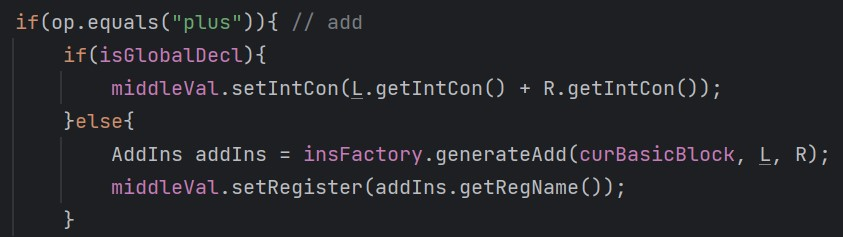

其中，`L`和`R`都是`MiddleValue`类的实例，是已经递归访问过加减号左右的乘法表达式后得到的值，`isGlobalDecl`就是使用的`boolean`类型变量，其命名可能有些争议，但此变量为`true`时表示当前处理的表达式是第一类表达式，需要直接计算出最终常量，相应的`L`和`R`也一定是常量。如图，如果`isGlobalDecl`为`true`，`middleValue`直接设置为了左右值相加的一个常量，反之，则需要为左右值生成一条`add`指令，并将`middleValue`设置为寄存器类型，寄存器名就是`add`指令返回值的寄存器名。这样一来，就解决了这个问题。

##### 变量

变量其实只关乎两类问题。一是值的计算，二是作用域和符号表的问题。第一点详细参考上述[表达式](#表达式)的处理，第二点在[符号表设计阶段](#符号表设计)实际上已经解决过了。

在代码生成部分，沿用了此前语法分析错误处理部分的符号表，依然是一张栈式动态符号表，随着`block`语法成分进行相应的创建和退出符号表的操作。

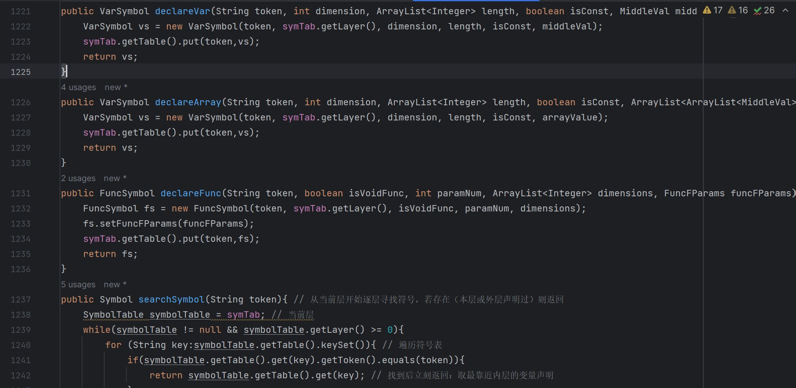

有关符号表的方法基本没变，只是稍做了契合代码生成程序的修改，同时增加了一个声明数组类变量的符号声明方法，它看起来和`declareVar`似乎没有太大的区别，这一点将在后面数组部分说明。

##### 条件语句：短路求值

此处涉及到了跳转指令，又由于条件指令加上了**短路求值**的要求，是笔者认为最难的一个部分。不论是分支语句`if`还是循环语句`for`，它们本身很简单，设计思想也都一样，无非是根据条件表达式进行**跳转**，但是引入短路求值后，更烦人的是条件语句自己的跳转。介绍短路求值思路前，先规定几个名词：

`if_label`：满足`Cond`所要执行的基本块；

`else_label`：不满足`Cond`所要执行的基本快；

`next_label`：整个if语句之后的第一个基本块。

上述都是`if`语句会产生的基本块，下面以`if-else`语句为例，介绍本项目的短路求值思路。

对于下面这条条件语句：

> `if(cond1 && cond2 || cond3 && cond4 && cond5 || cond6 && cond7)`

可以看成是由“`||`”连接了三个条件表达式，这三个条件表达式又分别由若干个基本条件表达式由“`&&`”连接而成，这一点很好理解，因为与的优先级高于或，可以把`&&`当作`*`，`||`当作`+`来理解。

这里，我们先提出一个结论：由文法规则可知，任意条件表达式一定可以写成如下的形式：

> `cond11 && cond12 && ... && cond1n || cond21 && ... && cond2n || ... || condm1 && ... && condmn`

其中，每个`condij`(0 < i < m, 0 < j < n)都是一个`EqExp`语法成分，这里暂且被称为**基本条件表达式**。

对于上述条件语句的一般形式，为了实现短路求值，将每一个**基本条件表达式**都设置为一个基本块，这些基本块之间需要实现这样的跳转逻辑：

从`cond11`开始：执行如下的步骤：

1. 若`i` < `m`且`j` < `n`，如果基本条件表达式`condij`为`true`，则跳转到`condi(j+1)`，若为`false`，则跳转到`cond(i+1)1`；

2. 若`i` < `m`且`j` = `n`，如果基本条件表达式`condij`为`true`，则跳转到`if_label`，若为`false`，则跳转到`cond(i+1)1`；

3. 若`i` = `m`且`j` < `n`，如果基本条件表达式`condij`为`true`，则跳转到`condi(j+1)`，若为`false`，则跳转到`else_label`；

4. 若`i` = `m`且`j` = `n`，如果基本条件表达式`condij`为`true`，则跳转到`if_label`，若为`false`，则跳转到`else_label`；

注：上述标签是对`if-else`语句而言的，如果没有`else`，需要将`else_label`改为`next_label`。

回到上面那个特殊些的例子，这个过程是这样的：

> `if(cond1 && cond2 || cond3 && cond4 && cond5 || cond6 && cond7)`

如果`cond1`为`true`，跳转到`cond2`，反之跳转到`cond3`；
如果`cond2`为`true`，跳转到`if_label`，反之跳转`cond3`；
如果`cond3`为`true`，跳转到`cond4`，反之跳转到`cond6`；
如果`cond4`为`true`，跳转到`cond5`，反之跳转到`cond6`；
如果`cond5`为`true`，跳转到`if_label`，反之跳转到`cond6`；
如果`cond6`为`true`，跳转到`cond7`，反之跳转到`else_label`；
如果`cond7`为`true`，跳转到`if_label`，反之跳转到`else_label`。

这样，就实现了控制流的短路求值，避免执行不应该执行的代码。

##### 数组

在代码生成涉及到了数组时，全局变量`middleValue`很难满足对与数组相关的表达式进行求值，因此声明了一个新的全局变量`ArrayList<ArrayList<MiddleValue>> arrayMiddleValue`来处理数组可能会出现的多个表达式的情况。例如，在此之前符号类`VarSymbol`只有一个记录普通变量值或寄存器名的`MiddleValue`类属性，但如果符号是一个数组变量，则需要新增一个二维`MiddleValue`数组来记录。

数组部分的任务可以大致分成几个小任务：

1. 数组变量定义，包括全局数组和局部数组。

2. 数组的访问，即读或写数组中某个单元的值。

3. 数组传参访问，即数组以指针形式作参数传入函数后的读与写。

数组的定义分为两种：全局数组定义和局部数组定义。对于全局数组，与其定义有关的表达式都当作常量表达式（上述的第一类表达式）计算出常量值，与普通变量的全局声明类似，但需要考虑数组的各维度的长度以及可能的全零初始化；对于局部数组，定义可以看作两个部分：首先是声明数组变量，只需要`alloca`给数组分配相应大小的空间即可，其次是初始化，这一步与对已声明的数组单元赋值没有区别，先使用`getelmentptr`计算相应位置的地址，再进行`store`赋值。

全局数组的全零初始化`zeroinitializer`：采用的是先填数再检查全零的方式，具体来说，在`LlvmGenerator`中调用`InsFactory.generateGlobalDecl()`方法生成全局声明语句并添加到`LlvmTree`中时，如果数组初始值全为零，这里产生的全局声明语句仍然是把所有的0一个一个填入数组的，但是在`GlobalDecl`类的`toString()`方法中，会再判断一次所填入的数字是否全为0，如果是，则输出"`zeroinitializer`"。

介绍完上面这些，任务1、2就已经告一段落了。对于任务3，看似复杂实则本质也只需要关注两个点：一是函数定义处和调用处形参和实参的输出格式，二是函数体中访问和使用形参的方式。

数组传参访问之所以区别于普通访问，主要是因为传参时将数组作为指针，舍弃了其长度（二维数组看作一维数组的数组，舍弃长度就是一个一维数组的指针，但是一维数组的长度本身是保留的，这一点学过C语言的都知道）。这其实反而简化了我们的工作。例如，访问一个普通的二维数组时，生成`getelementptr`需要得到数组的各维度的长度，但是访问二维数组参数则只用管第二维的长度：

```c
int f(int a[][3]){
   return a[0][0];
}
int main(){
    int local[2][3] = {{0,0,0},{1,1,1}};
    return local[0][0];
}
```

```llvm
%r3 = getelementptr [3 x i32], [3 x i32]* %r2, i32 0, i32 0 ;访问a的getelementptr指令

%r12 = getelementptr [2 x [3 x i32]], [2 x [3 x i32]]* %r5, i32 0, i32 0, i32 0 ;访问local的getelementptr指令
```

一维数组作参数传参就更简单了，由于舍弃了长度，传入变量类型就是`i32*`，`getelementptr`指令中`<ty>`就是`i32`。

在生成相关的访问数组的指令时，为了区分它是访问普通的数组还是访问作为参数的指针，在变量符号类`VarSymbol`中加入了`boolean`类型的`isPointer`变量，这样在递归程序访问到函数定义的形参列表，并为形参填符号表时，会在声明这些符号的时候将`isPointer`字段设置为`true`，在将来访问数组元素时，就会根据这个变量是否是指针类型来分别处理。

```java
// lVal的代码生成递归程序片段（访问变量）：
if(dimension == 0){ // 普通变量
    ...
}else if(dimension == 1){ // 一维数组
    if(vs.isPointer()){
        // 以指针形式访问一维数组（函数传参）
    }else{
        // 普通访问一维数组
    }
}else{ // 二维数组
    if(vs.isPointer()){
        ...
    }else{
        ...
    }
}
```

### 6.2 修改完善

总体而言代码生成阶段碰到了各种大小麻烦，这个部分代码量大、功能复杂，且要兼顾`llvm IR`语法正确性、翻译程序的正确性和目标代码的正确性，绕来绕去容易犯晕。不管是编码阶段还是debug阶段都碰到了前面几个阶段所未有的难题。这里提几个印象深刻的问题。

#### 6.2.1 终结指令缺失

##### 问题产生

出现这个问题纯粹是因为对`llvm IR`的语法规则了解不透彻导致的，在条件语句短路求值部分，每个“基本条件表达式”（见[条件语句](#条件语句短路求值)部分的介绍）都作为了一个基本块，由短路求值部分的介绍可知这些基本快构成了一个两层树状结构，用以处理`&&`和`||`两种优先级下的短路求值。但是这些基本块并没有实际功能代码，起作用的只是它们的标签，也就是说只是使用了这些标签来跳转实现短路。初期，对一个一般的条件语句，它生成的代码形如这样：

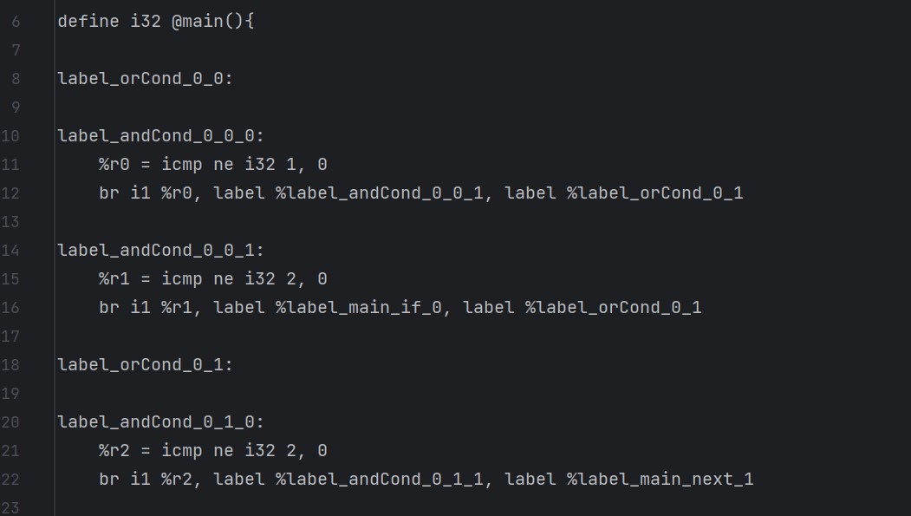

代码运行的报错开始也让人摸不着头脑直到看到了这段话：

> 终结指令一定位于某个基本块的末尾（否则中间就改变了基本块内的控制流）；反过来，每个基本块的末尾也一定是一条终结指令（否则仍然是顺序执行的，基本块不应该结束）。

原来每个基本快必须以一条终结指令结束。

##### 解决方案

知道问题所在解决起来就很简单了。前面提到，输出`llvm`代码是通过重写的`toString()`方法输出构建的`LlvmTree`类对象来实现的，只需要为函数中的基本块都做一次检查，给“不是以终结指令结尾”的基本块添加一条直接跳转到下一基本块的无条件跳转指令即可。此方法在代码生成主类中实现，命名为`fillBlankLabels`。

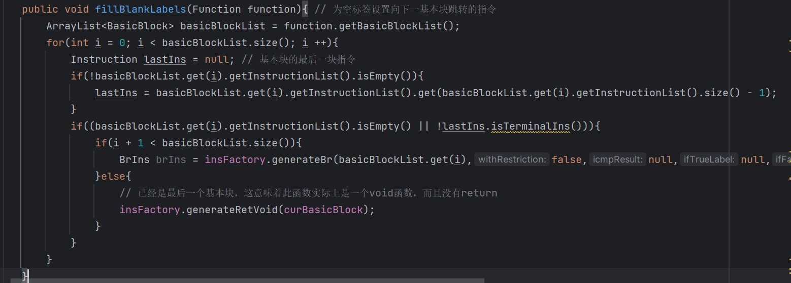


#### 6.2.2 嵌套的分支语句与循环语句

##### 问题产生

最初在设计`if`和`for`语句时，由于标签的定义在`Stmt`的递归方法中，而使用在条件表达式相关的`LAndExp`中，为了编码的方便，使用了几个全局变量来实现逻辑功能：例如`curNextBasicBlock`全局变量，表示为当前所处的`if-else`语句创建的next基本块。在单层的`if-else`语句中，这样的写法并不会造成什么问题。然而，`if-else`语句嵌套后就不一样了。

```c
if(cond1){
    if(cond2){
        ;
    }
    // 这里是内层if的next
}
// 这里是外层if的next
```

拿上面这个最简单的情况举例：

执行外层`if-Stmt`递归函数时，声明了两个标签：`if_basicBlock1`和`next_basicBlock1`（没有else）以及其对应的基本块，并用全局变量`curIfBasicBlock`和`curNextBasicBlock`记录下这两个基本块，执行`cond1`递归程序时，生成了相应的`llvm`代码，会在产生`icmp`指令后判断比较结果，如果`cond1`为`true`，跳转至`if_basicBlock1`，否则跳转至`next_basicBlock1`。此后，在第一层`if-Stmt`递归函数中，遇到`if`语句，又进入了`if-Stmt`函数中进行了递归调用。此时同理内层的`if`语句也会声明它的基本块，并用全局变量记录，这就覆盖掉了外层全局变量的值，当内层递归完成退栈后，本来应该为`nextBasicBlock1`继续生成指令，却误将`nextBasicBlock2`当成了`nextBasicBlock1`。


##### 解决方案

其实如果一开始就没用全局变量而是局部变量，用参数和返回值来在不同递归函数之间传值就不会产生这种问题。但是在已经使用且明显简化了代码的情况下，再动刀重构代价就有些大了。

为了防止`if`或`for`嵌套时，相应的`next`和`out`基本块不发生错乱，只需要在进入其递归函数后立刻记录下当前全局变量的值（这时候还是上一层的全局变量，相当于为上一层保存），在退出前恢复这些全局变量的值（相当于在回到上一层之前为它恢复了它的全局变量）即可，有些类似我们实现的栈式符号表。

## 七、总结

至此 **2023 Autumn** SysY Compiler项目就结束了，以上就是项目文档的全部内容，感谢您的耐心阅读。